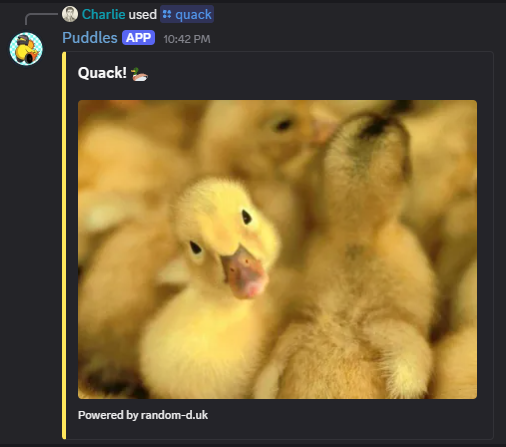

# Puddles Bot 2.1
[](https://www.python.org/downloads/)
[](https://github.com/Rapptz/discord.py)
[](https://hcb.hackclub.com/donations/start/ecoengine)
[](LICENSE)

## Add Puddles to Your Server:

<p align="center">
  
</p>
<p align="center">
  <a href="https://discord.com/oauth2/authorize?client_id=1388695231578509352&permissions=8&integration_type=0&scope=bot">
    
  </a>
</p>


##
**PuddlesBot2** is a comprehensive Discord bot featuring task management, leveling systems, music streaming, interactive messages, and much more. Built with modern Discord.py and designed for optimal performance and user experience.

## ✨ Key Features

- 📋 **Task Management** - A task system that stores everything
- ⭐ **Leveling System** - Separate text and voice XP tracking with anti-spam
- 🎵 **High-Quality Music Streaming** - Multi-platform support via Vocard & Lavalink
- 🎫 **Interactive Messages & Tickets** - Custom buttons for tickets and role management
- 📊 **Invite Tracking & Analytics** - Monitor server growth and invite sources
- 🎮 **Random Commands** - Memes, duck photos, coinflip with images, dice rolling
- 🔧 **Server Utilities** - Moderation tools, user info, and administrative features
- 🔄 **Persistent Views** - All systems work on reboot
- 📄 **Smart Pagination** - Easy navigation for large task lists

## 🚀 Quick Setup

### Prerequisites

- Python 3.8 or higher
- Discord Bot Token
- SQLite (included with Python)
- Git

### Installation

1. **Clone the repository**
   ```bash
   git clone https://github.com/yourusername/PuddlesBot2.git
   cd PuddlesBot2
   ```

2. **Install dependencies**
   ```bash
   pip install -r requirements.txt
   ```

3. **Configure the bot**
   - Create a .env file with a structure like the one below
   
```.env
DISCORD_TOKEN=
TOKEN=
DISCORD_CLIENT_ID=
BOT_OWNER_ID=
# Lavalink Configuration
LAVALINK_HOST=
LAVALINK_PORT=
LAVALINK_PASSWORD=
LAVALINK_SECURE=

# Optional Services (can be added later)
GENIUS_TOKEN=
MONGODB_URL=
MONGODB_NAME=
```

4. **Set up Lavalink (for music features)**
   - The bot uses Lavalink for music streaming
   - Default configuration connects to a public Lavalink node
   - For production, consider hosting your own Lavalink instance

5. **Run the bot**
   ```bash
   python main.py
   ```

## 📋 Command Reference

### Task Management Commands

| Command | Description | Permissions |
|---------|-------------|-------------|
| `/task` | Create new task assigned to multiple users | Whitelist/Admin |
| `/mytasks` | View all tasks assigned to you | All users |
| `/taskedit` | Edit existing tasks or delete them | Creator/Admin |
| `/snipe` | Claim credit for completed tasks (admin approval required) | All users |
| `/showtasks @user` | View tasks assigned to specific user | All users |
| `/alltasks` | View all active server tasks (paginated) | All users |
| `/oldtasks @user` | View completed tasks with statistics | All users |
| `/tcw @user add/remove` | Manage task creator whitelist | Admin |
| `/setsnipe #channel` | Set channel for snipe requests | Admin |
| `/clearsnipes` | Clear all pending snipe requests | Admin |

**Features:**
- **Multi-Assignee Support**: Assign tasks to multiple users with `@user1 @user2 @user3`
- **Task Sniping**: Claim credit for tasks you completed but weren't assigned to
- **No Late Penalty**: Sniped tasks won't be marked as late even if approved after due date
- **Smart Display**: Shows all assignees in task views with clear sniping indicators

<div style="text-align:left;">
  
  
</div>

### Interactive Messages & Tickets

| Command | Description | Permissions |
|---------|-------------|-------------|
| `/intmsg` | Create interactive messages with buttons | Whitelist/Admin |
| `/editintmsg [message_id]` | Edit existing interactive messages | Staff |
| `/listmessages` | List all interactive messages in server | Staff |
| `/ticketstats` | View ticket statistics and activity | Staff |
| `/imw @user add/remove` | Manage interactive message creator whitelist | Admin |

**Features:**
- **Ticket Creation**: Custom questions and automated ticket channels
- **Role Management**: Assign/remove roles with interactive buttons
- **Persistent**: Buttons work even after bot restarts
- **Custom Styling**: Full embed customization with colors and content

<div style="text-align:left;">
   
   
</div>

### Leveling System Commands

| Command | Description | Permissions |
|---------|-------------|-------------|
| `/rank @user` | View detailed rank card with progress bars | All users |
| `/top` | Display leaderboards (text/voice/total XP) | All users |
| `/setxp @user` | Set user's text or voice XP | Admin |
| `/setlevel @user` | Set user's text or voice level | Admin |
| `/lvlreset @user` | Reset user's levels and XP data | Admin |
| `/lvlconfig` | Configure XP rates and server settings | Admin |
| `/testxp @user` | Manually award XP for testing | Admin |
| `/testvoice @user` | Simulate voice time for testing | Admin |
| `/debugxp @user` | Debug XP system status for user | Admin |

**Features:**
- **Dual XP System**: Separate text and voice XP tracking
- **Anti-Spam Protection**: Cooldowns prevent XP farming
- **Visual Progress**: Beautiful rank cards with progress bars
- **Server Rankings**: Compare progress with other members


### Invite Tracking Commands

| Command | Description | Permissions |
|---------|-------------|-------------|
| `/topinvite` | Show top 10 inviters in server | All users |
| `/showinvites @user` | Detailed invite statistics for user | All users |
| `/resetinvites` | Reset all invite data (with confirmation) | Admin |
| `/editinvites @user` | Edit user's invite statistics | Admin |
| `/invw @user add/remove` | Manage invite admin whitelist | Admin |
| `/invitesync` | Manually sync invite data | Admin |
| `/invitestats` | Show comprehensive server invite statistics | Admin |
| `/invitereset` | Reset invite tracking tables (⚠️ deletes all data) | Admin |

**Features:**
- **Growth Analytics**: Track server growth and invite effectiveness
- **Success Rates**: Monitor invite conversion rates
- **Historical Data**: Comprehensive statistics and trends

### Music System Commands (Vocard)

| Command | Description | Permissions |
|---------|-------------|-------------|
| `/play [song]` | Play music from YouTube, Spotify, SoundCloud, etc. | All users |
| `/pause` / `/resume` | Pause or resume current track | All users |
| `/skip` / `/back` | Navigate through queue | All users |
| `/stop` / `/leave` | Stop music and leave voice channel | All users |
| `/queue` | View current music queue | All users |
| `/volume [0-100]` | Adjust music volume | All users |
| `/shuffle` | Shuffle the current queue | All users |
| `/loop [mode]` | Set loop mode (off/track/queue) | All users |
| `/nowplaying` | Show currently playing track | All users |
| `/search [query]` | Search for music across platforms | All users |
| `/quality` | Manage audio quality settings | Manager |
| `/audiostats` | Show audio performance metrics | All users |

**Features:**
- **Multi-Platform**: YouTube, Spotify, SoundCloud, Apple Music support
- **High-Quality Audio**: Configurable quality presets
- **Smart Queue**: Playlist support with shuffle and loop modes
- **Performance Metrics**: Real-time audio statistics

### Server Utilities & Moderation

| Command | Description | Permissions |
|---------|-------------|-------------|
| `/profile @user` | View customizable personal profile card | All users |
| `/user @user` | Show user information (ID, join date, etc.) | All users |
| `/avatar @user` | Get user's avatar image | All users |
| `/server` | Show detailed server information | All users |
| `/roles` | List all server roles and member counts | All users |
| `/moveme [channel/user]` | Move yourself to another voice channel | All users |
| `/ban @user [reason]` | Ban member from server | Admin |
| `/kick @user [reason]` | Kick member from server | Admin |
| `/purge [number] @user` | Clean up channel messages | Staff |

### Fun & Games Commands

| Command | Description | Permissions |
|---------|-------------|-------------|
| `/quack` | Get a random duck image 🦆 | All users |
| `/meme` | Get a random meme with metadata 😂 | All users |
| `/coinflip` | Flip a coin with actual coin images 🪙 | All users |
| `/diceroll [1-100]` | Roll dice with visual results | All users |
| `/help` | Show paginated help system | All users |

**Features:**
- **Visual Results**: Coinflip shows actual coin images from collection
- **NSFW Filtering**: Memes are automatically filtered for family-friendly content
- **Rich Metadata**: Meme information includes upvotes, subreddit, and original post
- **Random Variety**: Fresh content every time

<div style="text-align:left;">
   
   
</div>

### Admin & System Commands

| Command | Description | Permissions |
|---------|-------------|-------------|
| `/msg #channel` | Send your next message to any channel | Admin |
| `/fixdb` | Fix database schema issues | Admin |
| `/testpersistence` | Test the persistence system | Admin |
| `/multidimensionaltravel` | Get invites to all bot servers | Owner |
| `/gigaop` | Grant admin permissions for debugging | Owner |

**Features:**
- **Multi-line Messages**: `/msg` supports attachments and multi-line content
- **Mention Support**: Enables @everyone, @here, and role pings
- **Database Repair**: Automatic schema updates and corruption fixes

## 🔑 Permission Levels

- **[Owner]** - Bot owner only (ID: 699995264550961193)
- **[Admin]** - Requires Administrator permission
- **[Staff]** - Requires Manage Messages permission  
- **[Manager]** - Requires Manage Server permission
- **No tag** - Available to all users (some commands may require whitelist)

## 📁 Project Structure

```
PuddlesBot2/
├── main.py                 # Main bot file
├── tasks.py               # Task management system
├── lvl.py                 # Leveling system
├── inviter.py             # Invite tracking
├── intmsg.py              # Interactive messages
├── ticket_system.py       # Ticket management
├── fun.py                 # Fun commands
├── msg.py                 # Admin messaging
├── dice.py                # Dice rolling
├── help.py                # Help system
├── database.py            # Database management
├── utils.py               # Utility functions
├── requirements.txt       # Python dependencies
├── MusicSystem/           # Music bot integration
│   ├── main.py           # Music system entry point
│   ├── cogs/             # Music command cogs
│   ├── views/            # Music UI components
│   ├── voicelink/        # Voice connection handler
│   └── settings.json     # Music system configuration
└── data/                 # Database and logs
    ├── data.db    # SQLite database
    └── logs/             # Log files
```

## 🗄️ Database Schema

The bot uses SQLite with SQLAlchemy ORM for data persistence:

- **Tasks**: Multi-assignee task management with snipe tracking
- **UserXP**: Dual XP system (text/voice) with timestamps
- **InviteData**: Comprehensive invite tracking and analytics
- **InteractiveMessages**: Persistent button and embed storage
- **TicketData**: Support ticket management and statistics
- **Settings**: Per-server configuration and preferences

## 🔄 Updates & Maintenance

### Database Migrations

The bot automatically handles database schema updates:

```python
# Automatic migration on startup
migrate_database()  # Adds missing columns and tables
```

### Manual Database Repair

If needed, use `/fixdb` command to repair corrupted tables or force schema updates.

## 💝 Credits & Acknowledgments

### 🎵 Music System
- **[Vocard](https://github.com/ChocoMeow/Vocard)** - Advanced music bot framework providing multi-platform music streaming and high-quality audio processing
- **[Lavalink](https://github.com/lavalink-devs/Lavalink)** - Audio delivery node for efficient audio streaming and load balancing

### 🎮 Fun Commands APIs
- **[Meme API by D3vd](https://github.com/D3vd/Meme_Api)** - Provides fresh meme content from Reddit with metadata, NSFW filtering, and quality control
- **[Random Duck API](https://random-d.uk/)** - Delivers high-quality duck photography for instant mood boosters 🦆

### 🪙 Visual Assets
- **Coin Images** - Sourced from various online sources. We do not claim ownership of these images. If you own any of the coin images and would like them removed, please contact us and we will remove them immediately.

### 🏎️ Special Thanks
- **[EcoEngine](https://ecoengine.net/)** - For supporting the Mallard Motorsports team and its projects. Thank you for enabling continued development and innovation, and for believing in our mission! 🚀

### 💻 Development & Community
- **Discord.py** - Python Discord API wrapper that makes Discord bot development possible
- **SQLAlchemy** - Powerful database ORM framework for data persistence
- **Our amazing community** - Beta testers and feedback providers who help make the bot better
- **Open source contributors** - Making everything possible through shared knowledge and collaboration

## 🤝 Contributing

We welcome contributions! Please feel free to:

1. **Report Issues**: Found a bug? Let us know!
2. **Suggest Features**: Have ideas for improvements?
3. **Submit Pull Requests**: Help us make the bot better
4. **Improve Documentation**: Help others understand how to use the bot

## 📞 Support
https://discord.gg/PGjXDgu36s

